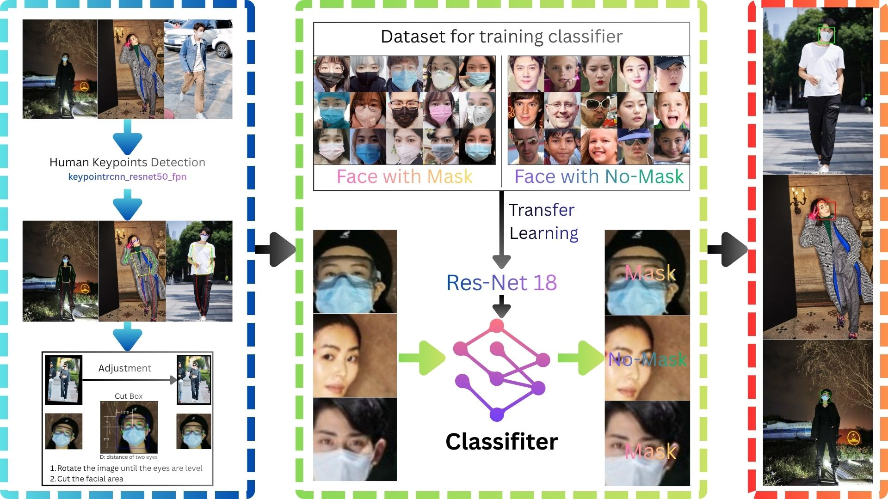

# Face Mask Detection using Human Keypoints
<p align="center">
    
    
    
</p>


## Getting Started

```
git clone

pip install -r requirement.txt

python main_image.py # demo a picure
```

## Overview
This project implements a robust two-stage pipeline for face mask detection, designed to overcome the limitations of traditional one-stage detectors in complex real-world scenarios. By integrating Human Pose Estimation, the system achieves high-precision facial localization even under challenging head poses.

The core innovation lies in using human keypoints (eyes and nose) to define the Face ROI (Region of Interest) and applying Affine Transformations for normalization. This ensures the classifier receives a standardized, horizontally aligned facial input, significantly enhancing the robustness and accuracy of the mask detection across diverse orientations.
## System Architecture

<p align="center">
    
    <br>
    <em>Figure 1: Face Mask Detection using Human Keypoints System</em>
</p>


## Technical Highlights

### 1. Pose-based Localization
Leverages **Keypoint R-CNN** to detect 17 human keypoints. By specifically extracting the $(x, y)$ coordinates of the eyes and nose, the system defines a robust Face ROI (Region of Interest) that is more stable than traditional bounding-box-only detection, especially in crowded scenes.
### 2. Affine Transformation & Alignment
To handle varied head poses, a custom `FaceProcessor` calculates the tilt angle based on the eye-line vector. It applies an **Affine Transformation** to normalize the head roll angle, ensuring facial features are horizontally aligned. This canonical view significantly reduces the complexity for the subsequent classifier.
### 3. Transfer Learning Classification
A fine-tuned **ResNet-18** architecture serves as the core classifier. By feeding it aligned, high-quality facial crops, the model achieves high accuracy in binary classification (Mask vs. No-mask) with minimal computational overhead.


## Train and Evaluate
### Train a classifier
#### Dataset for training classifier

| mask  | nomask |
|-------|--------|
|  |   |
#### Train history
The training plots illustrate the convergence of the ResNet-18 classifier over 25 epochs. The model achieved a high validation accuracy (approaching 100%) early in the training process, with both training and validation losses steadily declining, indicating stable learning and effective feature extraction for mask classification.
<p align="center">
  
</p>

### System-Level Evaluation
The following matrices show the system's performance under different IoU thresholds, demonstrating the trade-off between localization precision and classification success.

<p align="center">
  
  
  
</p>

<p align="center">
  
  
  
</p>

#### Precision, Recall, F1-score, Accuracy in different IoU
The plots visualize the ResNet-18 classifier's performance over 25 epochs. The model demonstrates rapid convergence, with the validation accuracy quickly stabilizing near 100%. The consistent decline in both training and validation losses, coupled with high precision across all epochs, indicates a highly effective feature extraction process and robust generalization for face mask classification.
<p align="center">
  
    <br>
    <em>Figure ：System Performance Evaluation across Multiple IoU Thresholds</em>
</p>

## Future Work
1. Compare against end-to-end object detection models (e.g. YOLO)
2. Explore Vision-Language Models (VLMs), such as CLIP, for zero-shot mask detection

