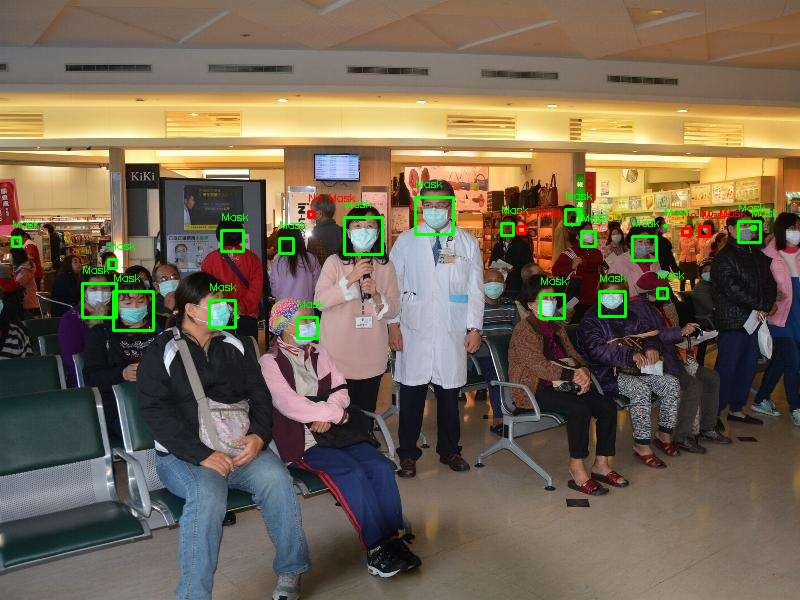
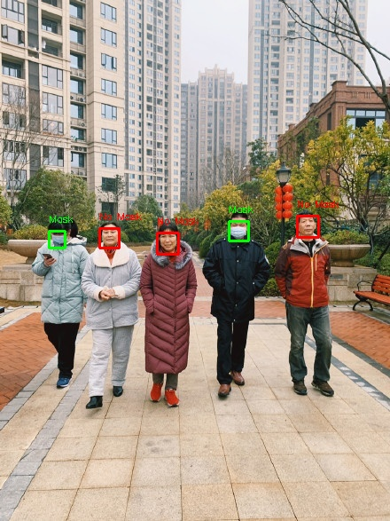
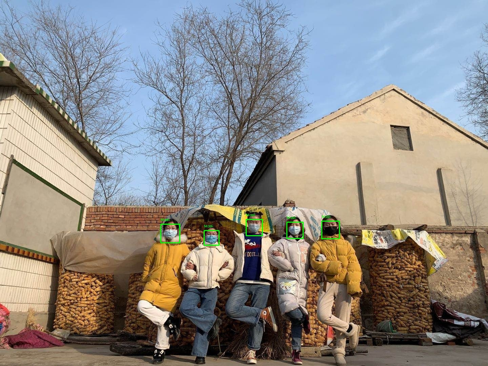
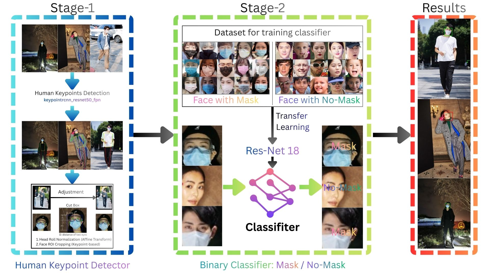
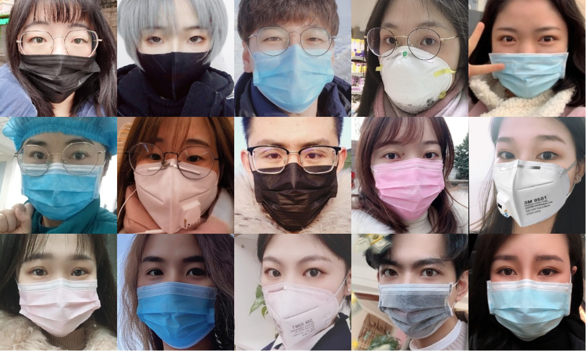
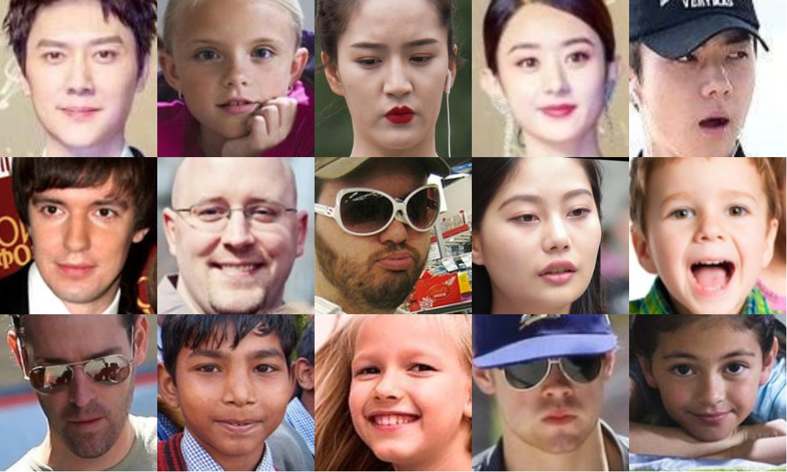
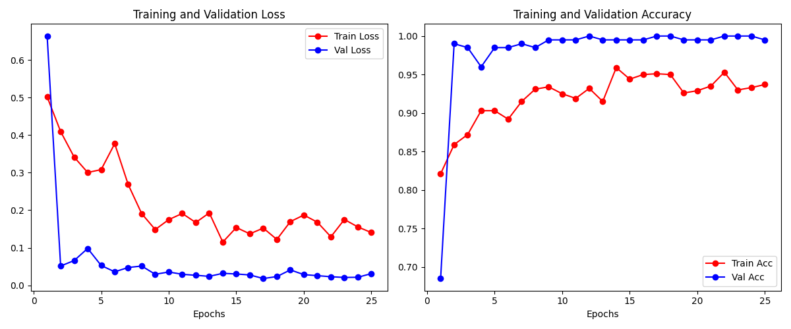
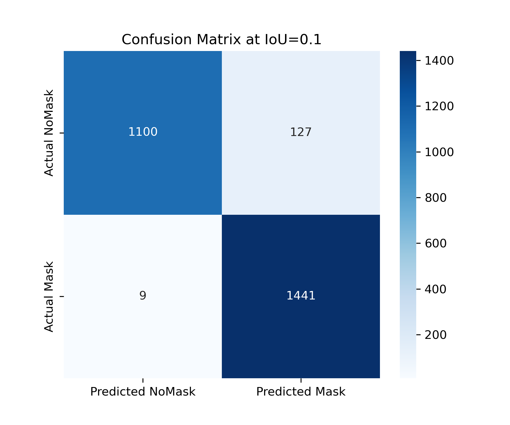
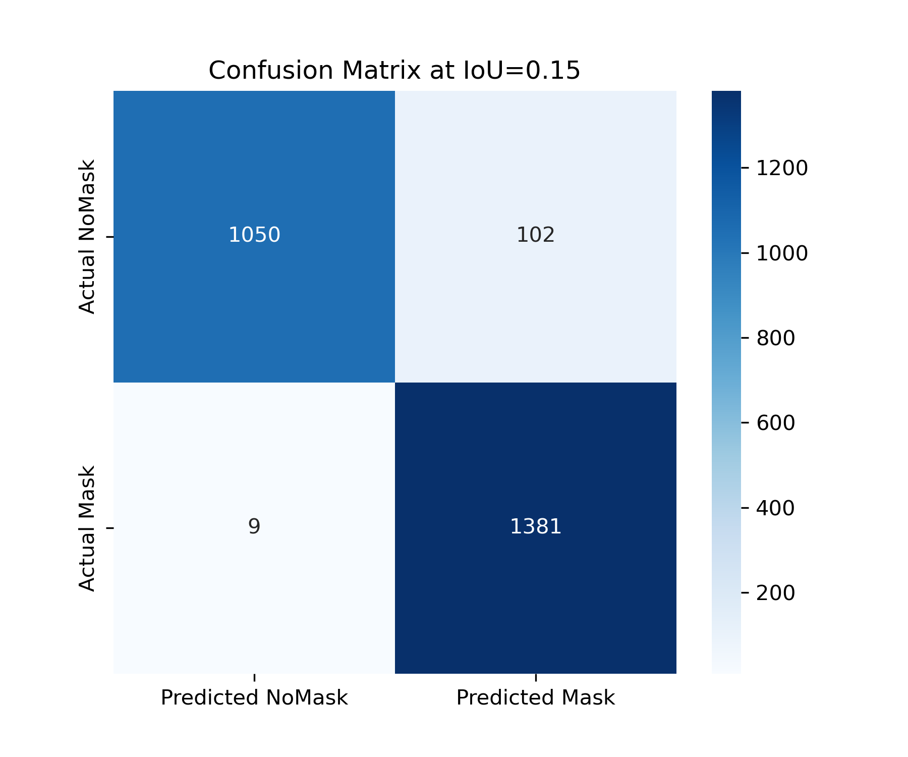
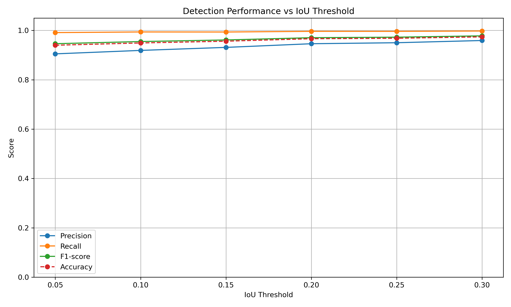

# Face Mask Detection using Human Keypoints

<p align="center">
    
    
    
</p>

## Getting Started

```
git clone

pip install -r requirement.txt

python main_image.py # demo a picture
```

## Project Structure

```
Face-Mask-Detection-Using-Human-Keypoints/
│
├── src/
│   ├── core/           # detector, classifier, face processor
│   ├── utils/          # parser, drawer
│   ├── scripts/        # train binary classifier, evaluation tools
│
├── data/
│   ├──Data 
│   │   ├── data/           # images
│   │   └── label/          # annotations
│   ├──train_classifier_data
│   │   ├── train/
│   │   └── val/
│
├── Model/              # trained models
├── main_image.py/      # demo: test one image 
├── README.md
└── requirements.txt

```

## Overview

This project implements a robust two-stage pipeline for face mask detection, designed to overcome the limitations of
traditional one-stage detectors in complex real-world scenarios. By integrating Human Pose Estimation, the system
achieves high-precision facial localization even under challenging head poses.

The core innovation lies in using human keypoints (eyes and nose) to define the Face ROI (Region of Interest) and
applying Affine Transformations for normalization. This ensures the classifier receives a standardized, horizontally
aligned facial input, significantly enhancing the robustness and accuracy of the mask detection across diverse
orientations.

## System Architecture

The system consists of following steps:

1. Human Keypoint Detection
2. Face Region Extraction
3. Mask Classification
4. Evaluation (IoU, TP/FP/FN) and Visualization

<p align="center">
    
    <br>
    <em>Figure 1: Face Mask Detection using Human Keypoints System</em>
</p>

### Step-1 Human Keypoint Detection

`src/core/detector.py`, `src/utils/parser.py`

Our method replaces face detection with pose-guided alignment. Human keypoints(**Keypoint R-CNN**) are detected to
localize the upper-body and facial regions.
Low-confidence detections are filtered to reduce false positives. Key benefits:

1. Face localization without explicit face detector
2. More stable under partial occlusion
3. Decouples person detection from mask classification

### Step-2 Face Process

`src/core/face_processor.py`

Based on detected facial keypoints, the face region is cropped and normalized before classification. This step ensures:
1.Consistent input size for the classifier;
2.Reduced background noise; 3.Better generalization across different poses.

### Step-3 Mask Classification

`src/scripts/train_classifier.py`,`src/core/classifier.py`

A fine-tuned **ResNet-18** classifier is applied to each cropped face image to determine mask-wearing status:

1. Mask
2. No Mask

## Train and Evaluate

### Train Binary Classifier (mask VS nomask)

#### 1. Dataset.

It is seen in `data/train_classifier_data`, **1000** images (mask: 500, nomask: 500) for train and **200** (mask:
100, nomask: 100) for validation.Same dataset samples is seen blew.

| mask                                                | nomask                                                |
|-----------------------------------------------------|-------------------------------------------------------|
|  |  |

#### 2. Train performance.

`src/scripts/train_classifier.py` The training plots illustrate the convergence of the **ResNet-18** classifier over 25
epochs. The model achieved a high validation accuracy (**approaching 100%**) early in the training process, with both training and validation losses
steadily declining, indicating stable learning and effective feature extraction for mask classification.

<p align="center">
  
</p>

### System-Level Evaluation

`src/scripts/evaluate_system.py`

For each image and IoU threshold, the following are computed:

1. True Positive (TP)
2. False Positive (FP)
3. True Negative (TN)
4. False Negative (FN)

From these, standard metrics are derived:

1. Accuracy
2. Precision
3. Recall
4. F1-score

#### Dataset

These are **1264 faces** are labeled as **"mask"** and **1091 faces** are labeled as **"nomask"** in total **1174 images
**. The data is in `data/Data/data`, and label is in `data/Data/label`. Ad data label is used VoTT.

#### 1. Confusion Matrix

The following matrices show the system's performance under different IoU thresholds, demonstrating the trade-off between
localization precision and classification success.

<p align="center">
  
  
  
</p>

<p align="center">
  
  
  
</p>

#### 2. Accuracy, Precision, Recall, F1-score

The plots visualize the ResNet-18 classifier's performance over 25 epochs. The model demonstrates rapid convergence,
with the validation accuracy quickly stabilizing near 100%. The consistent decline in both training and validation
losses, coupled with high precision across all epochs, indicates a highly effective feature extraction process and
robust generalization for face mask classification.
<p align="center">
  
</p>

For Examples, IoU=0.3

1. Precision = 0.95
2. Accuracy = 0.97
2. Recall = 0.99
3. FPR = 0.05
4. F1-score = 0.97

More detail data is seen in `assert/eval_history.json`

## Future Work

1. Compare against end-to-end object detection models (e.g. YOLO)
2. Explore Vision-Language Models (VLMs) to detection face mask, such as CLIP(Contrastive Language-Image Pretraining)
3. Incorporating temporal consistency for video-based detection
4. Exploring lightweight deployment on edge devices

## Related

1. https://docs.pytorch.org/vision/main/models/generated/torchvision.models.detection.keypointrcnn_resnet50_fpn.html
2. https://docs.pytorch.org/tutorials/beginner/transfer_learning_tutorial.html
3. https://learn.microsoft.com/en-us/dotnet/machine-learning/how-to-guides/label-images-for-object-detection-using-vott
4. https://openai.com/index/clip/

